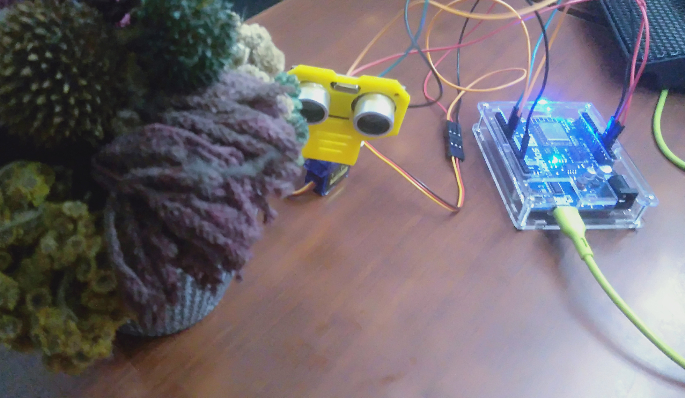
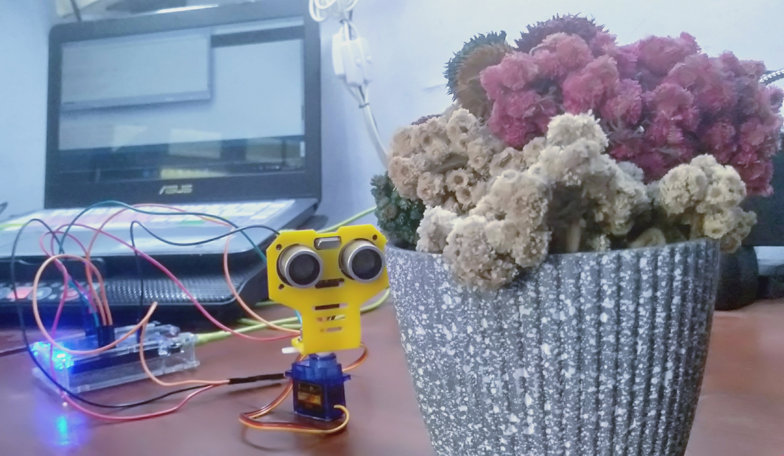
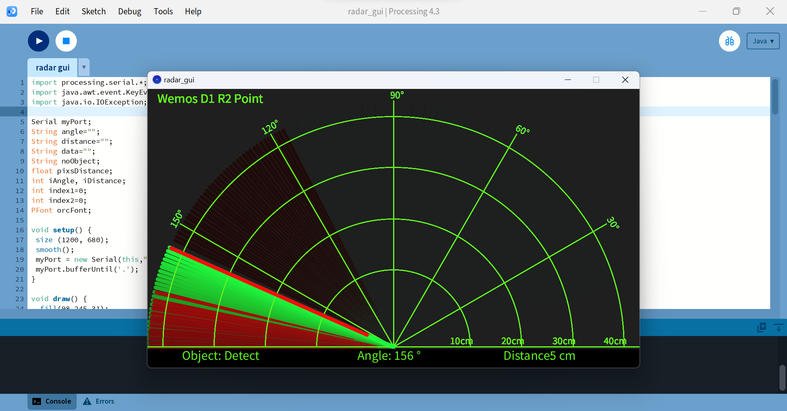

[](https://github.com/ellerbrock/open-source-badges/)
[](https://opensource.org/licenses/MIT)


# IoT-based-Radar-with-Wemos-D1-R2
<strong>UCI Coursera Final Project 2023</strong><br><br>
This radar is closely related to defense technology, where this tool can function as a determinant of the direction of movement / position / shape of a detected object. The purpose of this project is to be able to make a simple radar system from the utilization of Ultrasonic sensors. This project has been implemented and took approximately 1 day. This radar system is based on the Internet of Things, so it uses MQTT as its communication protocol. The system interface can be accessed alternately through Serial Monitor and Processing. The benefit of making this project is none other than to gain experience. The results show that the system can function properly.

<br><br>

## Project Requirements
| Part | Description |
| --- | --- |
| Development Board | Wemos D1 R2 |
| Code Editor | • Arduino IDE<br>• Processing |
| Driver | CH340 USB Driver |
| IoT Platform | mosquitto |
| Communications Protocol | Message Queuing Telemetry Transport (MQTT) |
| IoT Architecture | 3 Layer |
| Application Support | MQTT Explorer |
| Programming Language | • C/C++<br>• Processing |
| Arduino Library | • ESP8266WiFi (default)<br>• PubSubClient<br>• ArduinoJson<br>• Servo |
| Actuators | Servo Motor SG90 180° (x1) |
| Sensor | HC-SR04: Ultrasonic Sensor (x1) |
| Other Components | • Micro USB cable - USB type A (x1)<br>• Jumper cable (1 set)<br>• Screws (1 set)<br>• HC-SR04 Mounting Bracket (x1) |

<br><br>

## Download & Install
1. Arduino IDE

   <table><tr><td width="810">
   
   ```
   https://bit.ly/ArduinoIDE_Installer
   ```

   </td></tr></table><br>
   
2. Processing

   <table><tr><td width="810">
   
   ```
   https://bit.ly/Processing_Installer
   ```

   </td></tr></table><br>

3. MQTT Explorer

   <table><tr><td width="810">
   
   ```
   https://bit.ly/MQTT_Explorer_Installer
   ```

   </td></tr></table><br>
   
4. CH340 USB Driver

   <table><tr><td width="810">

   ```
   https://bit.ly/CH340_USB_Driver
   ```

   </td></tr></table>
   
<br><br>

## System Flow Schematic
When an object is in the sensor detection area, the sensor will respond by sending publish data to the IoT platform (mosquitto) and then sending back in the form of subscribe data to be displayed on the serial monitor. As for the graph, users can also see a significant color difference in the detection area. If no object is found, the sensor and actuator will always be on standby.

<br><br>

## Project Designs
<table>
<tr>
<th width="420">Block Diagram</th>
<th width="420">Pictorial Diagram</th>
</tr>
<tr>
<td></td>
<td></td>
</tr>
</table>
<table>
<tr>
<th width="840">Wiring</th>
</tr>
<tr>
<td></td>
</tr>
</table>

<br><br>

## Arduino IDE Setup
1. Open the ``` Arduino IDE ``` first, then open this project by clicking ``` File ``` -> ``` Open ``` : 

   <table><tr><td width="810">
      
      ``` wemos_d1r2_radar.ino ```

   </td></tr></table><br>
   
2. Fill in the ``` Additional Board Manager URLs ``` in Arduino IDE

   <table><tr><td width="810">
      
      Click ``` File ``` -> ``` Preferences ``` -> enter the ``` Boards Manager Url ``` by copying the following link :
      
      ```
      http://arduino.esp8266.com/stable/package_esp8266com_index.json
      ```

   </td></tr></table><br>
   
3. ``` Board Setup ``` in Arduino IDE

   <table>
      <tr><th width="810">

      How to setup the ``` WEMOS D1 R2 ``` board
            
      </th></tr>
      <tr><td>
      
      • Click ``` Tools ``` -> ``` Board ``` -> ``` Boards Manager ``` -> Install ``` esp8266 ```.

      • Then click ``` Tools ``` -> ``` Board ``` -> ``` ESP8266 Board ``` -> ``` LOLIN(WEMOS) D1 R2 & mini ```.

      </td></tr>
   </table><br>
   
4. ``` Change the Board Speed ``` in Arduino IDE

   <table><tr><td width="810">
      
      Click ``` Tools ``` -> ``` Upload Speed ``` -> ``` 115200 ```

   </td></tr></table><br>
   
5. ``` Install Library ``` in Arduino IDE

   <table><tr><td width="810">
      
      Download all the library zip files. Then paste it in the: ``` C:\Users\Computer_Username\Documents\Arduino\libraries ```

   </td></tr></table><br>

6. ``` Port Setup ``` in Arduino IDE

   <table><tr><td width="810">
      
      Click ``` Port ``` -> Choose according to your device port ``` (you can see in device manager) ```

   </td></tr></table><br>

7. Change the ``` WiFi Name ```, ``` WiFi Password ```, and ``` Client ID ``` according to what you are currently using.<br><br>

8. Before uploading the program please click: ``` Verify ```.<br><br>

9. If there is no error in the program code, then please click: ``` Upload ```.<br><br>

10. If there is still a problem when uploading the program, then try checking the ``` driver ``` / ``` port ``` / ``` others ``` section.

<br><br>

## Processing Setup
1. Open the ``` Processing ``` first, then open the Radar GUI project by clicking ``` File ``` -> ``` Open ``` : 

   <table><tr><td width="810">
      
      ``` radar_gui.pde ```

   </td></tr></table><br>

2. Customize your ``` port ``` with the one in the ``` Arduino IDE ```. This is so that the board can be recognized by ``` Processing ```, so that the code can be run properly.<br><br>

3. The last step, please click: ``` Run ```.

<br><br>

## MQTT Explorer Setup
1. Open the ``` MQTT Explorer ```. Then, click the Connections: ``` test.mosquitto.org ```.<br><br>

2. Click the ``` ADVANCED ``` -> ``` Delete All Topics ```.<br><br>

3. Create a ``` new Topic ``` with QoS "0":

   <table><tr><td width="810">
      
   ```
   coursera/uci/radar
   ```

   </td></tr></table><br>

4. Copy and paste the ``` Client ID ``` into the ``` Arduino IDE ``` project.<br><br>

5. Next, click: ``` BACK ```. The last step, please click: ``` CONNECT ```.

<br><br>

## Get Started
1. Download and extract this repository.<br><br>

2. Make sure you have the necessary electronic components.<br><br>
   
3. Make sure your components are designed according to the diagram.<br><br>
   
4. Configure your device according to the settings above.<br><br>
   
5. Please enjoy [Done].

<br><br>

## Highlights
<table>
<tr>
<th width="840" colspan="2">Device</th>
</tr>
<tr>
<td width="420"></td>
<td width="420"></td>
</tr>
</table>
<table>
<tr>
<th width="840" colspan="2">MQTT Explorer (JSON data on Topic)</th>
</tr>
<tr>
<td width="420"></td>
<td width="420"></td>
</tr>
</table>
<table>
<tr>
<th width="840" colspan="2">Serial Monitor (Publish & Subscribe)</th>
</tr>
<tr>
<td width="420"></td>
<td width="420"></td>
</tr>
</table>
<table>
<tr>
<th width="840">Processing (Radar Graphic User Interface)</th>
</tr>
<tr>
<td></td>
</tr>
</table>

<br><br>

## Reminder
<table><tr><td width="840">
   
1. Before starting the project, you should test the components first to make sure the devices used can work properly. This has been provided by the creator of the program, please download and try one section at a time.
   
2. The use of serial communication between Arduino IDE and Processing cannot be run simultaneously, so if you want to open the Processing GUI then at the same time you cannot open the Serial Monitor Arduino IDE. It also applies to the other way around.

</td></tr></table>

<br><br>

## Component Testing
You can download the component test file via the following link: <a href="https://github.com/devancakra/IoT-based-Radar-with-Wemos-D1-R2/tree/master/Assets/Component%20Testing">Click Here</a>

<br><br>

## Appreciation
If this work is useful to you, then support this work as a form of appreciation to the author by clicking the ``` ⭐Star ``` button at the top of the repository.

<br><br>

## Disclaimer
This application is my own work and is not the result of plagiarism from other people's research or work, except those related to third party services which include: editor code, libraries, frameworks, and so on.

<br><br>

## LICENSE
MIT License - Copyright © 2023 - Devan C. M. Wijaya, S.Kom

Permission is hereby granted without charge to any person obtaining a copy of this software and the software-related documentation files to deal in them without restriction, including without limitation the right to use, copy, modify, merge, publish, distribute, sublicense, and/or sell copies of the Software, and to permit persons receiving the Software to be furnished therewith on the following terms:

The above copyright notice and this permission notice must accompany all copies or substantial portions of the Software.

IN ANY EVENT, THE AUTHOR OR COPYRIGHT HOLDER HEREIN RETAINS FULL OWNERSHIP RIGHTS. THE SOFTWARE IS PROVIDED AS IS, WITHOUT WARRANTY OF ANY KIND, EITHER EXPRESS OR IMPLIED, THEREFORE IF ANY DAMAGE, LOSS, OR OTHERWISE ARISES FROM THE USE OR OTHER DEALINGS IN THE SOFTWARE, THE AUTHOR OR COPYRIGHT HOLDER SHALL NOT BE LIABLE, AS THE USE OF THE SOFTWARE IS NOT COMPELLED AT ALL, SO THE RISK IS YOUR OWN.
